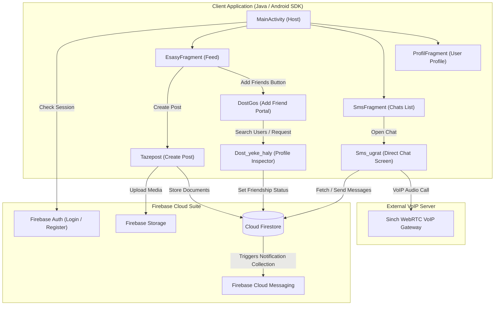

# Gurles (AndroidBlogApp)

**Gurles** (derived from the Turkmen word *gürleş*, meaning "to chat" or "to speak") is a comprehensive native Android social networking and real-time messaging application. Built entirely in Java, the application couples a Firebase cloud backend with Sinch RTC to host user accounts, coordinate social feeds with image-cropping/compressing utilities, synchronize chat channels, and support carrier-grade voice calls.

---

## 🧭 Architectural Overview & User Flows

The following diagram illustrates how the core activities, fragments, database storage, and external voice servers coordinate:



---

## 📂 Codebase Translation Guide (Turkmen ➔ English Target)

To help developers navigate the codebase, this table maps the Turkmen naming conventions used in Java classes, layout names, and database indexes directly to their English functional meanings:

| File / Entity Name | Type | English Explanation / Role |
| :--- | :--- | :--- |
| **gürleş / gurles** | App Name / Pkg | "Converse" or "Speak" (the main name of this chat app). |
| **Esasy** | Directory/Class | **Main / Primary**. `EsasyFragment` is the primary main feed page. |
| **Täze post / Tazepost** | Class | **New Post**. Activity interface for uploading text and files. |
| **Pikir üýtget / Pikir_uytget**| Class | **Change opinion / comment**. Form to modify comments on posts. |
| **Sms ugrat / Sms_ugrat** | Class | **Send Message**. The activity rendering the direct chat bubble room. |
| **Ýeke haly / yeke haly** | Layout/Class | **Individual state / Single list item layout** (e.g. `recycle_yeke_haly4.xml`). |
| **Sazlamalar** | Class/Layout | **Settings**. View to custom-edit user profiles, bio descriptions, etc. |
| **At üýtget / At_uytget** | Class | **Change name**. Inner menu to update display names. |
| **Dost goş / DostGos** | Class/Layout | **Add Friend**. Main console to lookup and add users. |
| **Dost gözle / Dost_gozle** | Class | **Search Friend**. Query logic searching user accounts. |
| **Dost gelen / Dost_gelen** | Class | **Incoming Friend Request**. Sub-fragment listing received requests. |
| **Obşiy dostlar / Obshydostlar**| Class/Adapter | **Shared Friends / Mutual Friends** (blend of Russian *obshiy* + Turkmen *dostlar*). |
| **Saklanan** | Class | **Saved**. Bookmarks folder containing favored/saved posts. |
| **Blok** | Class/Layout | **Block**. Features to black-list profiles and restrict message delivery. |
| **Surat** | File/Field | **Picture / Image**. Variable used to reference avatar/post image URLs. |
| **Wagt** | Db Field | **Time / Timestamp**. Databases store the server timestamps using this name. |
| **Ady** | Db Field | **Name / Screen Name**. Screen name parameter stored in accounts doc. |
| **Son / Şon** | Db Field | **Last / Active status**. Stores "last active" server timestamp. |
| **Ýazýar / Yazyar** | Db Field | **Typing**. Transient field set when user is actively writing messages. |

---

## 🗄️ Detailed Firestore Database Schema

The app utilizes a NoSQL collection tree in Cloud Firestore. Below are the key data paths:

### 1. `/ulanyjylar` (Users Collection)
Root document mapping user detail nodes, status tickers, presence logs, and subcollections.
- **Fields**:
    - `ady` (String): Clean display name.
    - `surat` (String): Profile image URL saved in Storage.
    - `arkafon` (String): Biography banner image URL.
    - `pikir` (String): User's profile status text/biography.
    - `status` (String): Active status (`"online"` or `"offline"`).
    - `son` (Timestamp): Timestamp representation of the user's last action/presence.
    - `typing` (String): Stores the friend ID user is currently typing message to (else empty).
    - `token` (String): Direct FCM client registration token.

#### Subcollections under `/ulanyjylar/{userId}/`

#### A. `postlar` (User's Posts)
Stores individual multimedia entries uploaded by this user.
- **Fields**:
    - `informasiya` (String): Body explanation text of the post.
    - `surat_url` (List<String>): List containing image storage URLs, or single video storage URL.
    - `tipi` (String): Differentiate rendering components (`"post"`, `"video"`, `"profil"`).
    - `wagt` (Timestamp): Creation server time.
    - `user_id` (String): Reference tracking back to the author.
- **Nested Collections under `postlar`**:
    - `Like`: Documents created under `/ulanyjylar/{userId}/postlar/{postId}/Like/{likedUserId}` with field `{wagt: Timestamp}` indicating likes.
    - `Komment`: Collection `/ulanyjylar/{userId}/postlar/{postId}/Komment/` storing:
        - `sms` (String): Text message of comment.
        - `userid` (String): User commenting.
        - `wagt` (Timestamp): Comment timestamp.

#### B. `dostlar` (Friends List)
- **Document ID**: `{friendUserId}`
- **Fields**:
    - `user_id` (String): Friends Uid.
    - `ady` (String): Friend's display name.

#### C. `dost_ugradylan` & `dost_iberen` (Friend Requests Pipeline)
Stores outbound pending invitations and incoming requests.
- **dost_ugradylan** (Pending Sent): `/ulanyjylar/{myId}/dost_ugradylan/{targetId}`
- **dost_iberen** (Pending Received): `/ulanyjylar/{targetId}/dost_iberen/{myId}`

#### D. `hatlar` (Message Storage Root)
Messages are written in two places so both users can paginate messages natively.
- **Path**: `/ulanyjylar/{myId}/hatlar/{friendId}/hat/{messageDocId}`
- **Fields**:
    - `message` (String): Text string, Storage image URL, or Storage audio local path.
    - `type` (String): Bubble renderer selector (`"text"`, `"surat"`, `"audio"`).
    - `from` (String): Sender ID.
    - `seen` (Boolean): Read check flag.
    - `time` (Timestamp): Server time.
    - `blogpost` (String): Non-empty if post share event occurred.

#### E. `chat` (Active Chats Index)
Serves to build the central Chats List UI (`SmsFragment`) representing conversation history.
- **Path**: `/ulanyjylar/{myId}/chat/{friendId}`
- **Fields**:
    - `time` (Timestamp): Time of last conversation event.
    - `from` (String): Sender origin.

#### F. `blok` & `saklanan` (Bookmarks & Blocks)
- **blok**: `/ulanyjylar/{myId}/blok/{blockedUserId}` -> Prevents contacts.
- **saklanan**: `/ulanyjylar/{myId}/saklanan/{savedPostId}` -> Stores duplicate posts parameters locally.

---

## 📞 VoIP Integration Guide (Sinch RTC)

Real-time audio-calling is powered by Sinch. Clients request and host call clients using WebRTC protocol handshakes.

### Credentials Setup
Locate the VoIP registration configurations inside `Sms_ugrat.java` and `SinchClass.java`. Ensure these match your active Sinch app registry:

```java
// Located inside local calling instances:
sinchClient = Sinch.getSinchClientBuilder()
    .context(this)
    .applicationKey("YOUR_SINCH_APP_KEY")
    .applicationSecret("YOUR_SINCH_APP_SECRET")
    .environmentHost("clientapi.sinch.com") // Target gateway cluster
    .userId(user_id)
    .build();

sinchClient.setSupportCalling(true);
sinchClient.startListeningOnActiveConnection();
sinchClient.start();
```

*Note: Ensure permissions for microphone, recording audio, and phone calls (`Manifest.permission.RECORD_AUDIO`, `Manifest.permission.CALL_PHONE`) are requested at runtime before initiating calls.*

---

## ⚙️ Initial Project Configuration & Installation

Follow this checklist to setup the project landscape locally:

### 1. Requirements
- **JDK 17** configured inside development workspace.
- **Android Studio Giraffe** (or newer version).
- **Target SDK 34** and **Minimum SDK 23** configurations.

### 2. Configure dependencies in Gradle
Android dependencies are defined under `app/build.gradle`. Key components include the Firebase BOM platform alongside media compressors:

```groovy
dependencies {
    // Firebase Bill of Materials (BOM)
    implementation platform('com.google.firebase:firebase-bom:33.2.0')
    implementation 'com.google.firebase:firebase-auth'
    implementation 'com.google.firebase:firebase-storage'
    implementation 'com.google.firebase:firebase-firestore'
    implementation 'com.google.firebase:firebase-database'
    implementation 'com.google.firebase:firebase-messaging'

    // Media & UI Tools
    implementation 'com.github.bumptech.glide:glide:4.15.1'
    implementation 'id.zelory:compressor:3.0.1'
    implementation 'com.vanniktech:android-image-cropper:4.6.0'
    implementation(name: 'sinch-android-rtc', version: '+', ext: 'aar')
}
```

### 3. Setup Project Services
1. Download a custom `google-services.json` configuring Firebase services.
2. Put `google-services.json` into: `app/google-services.json`.
3. Put the `sinch-android-rtc.aar` library binary under the `app/libs/` directory.
4. Execute Gradle sync.
5. Compile and install local developer builds:
   ```powershell
   ./gradlew assembleDebug
   ```
